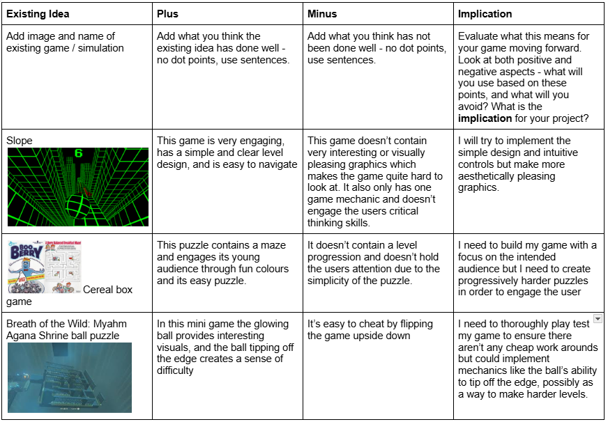
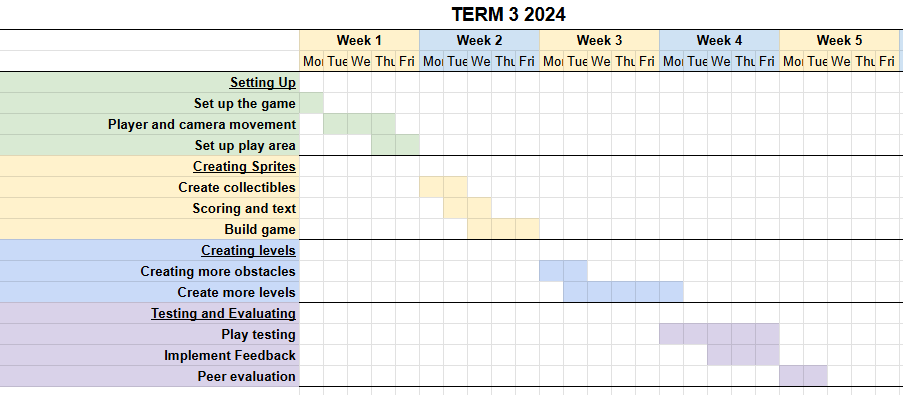
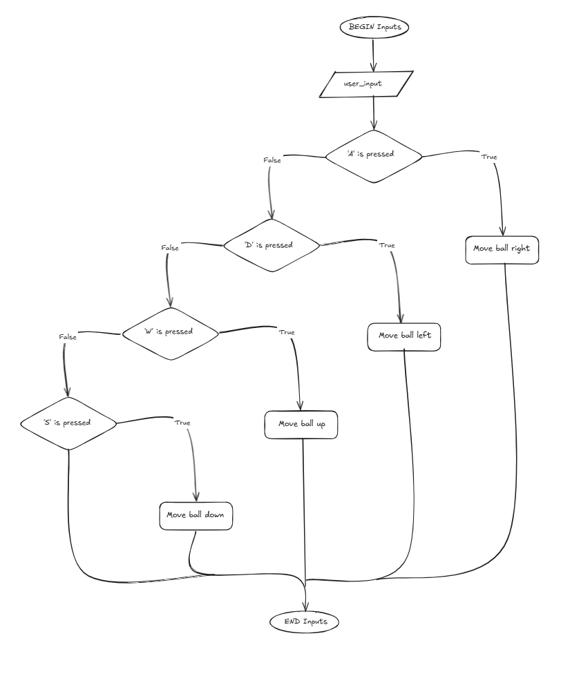
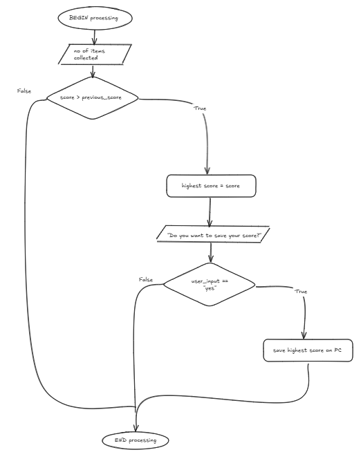
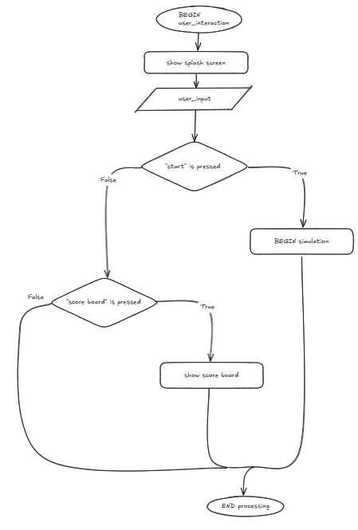
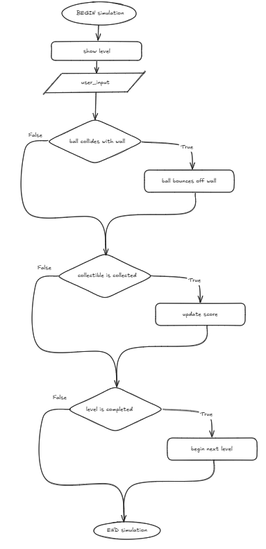

# Project Development
## Identifying and Defining
### Identifying a Need
- Need: To improve children's fine motor skills and problem-solving ability in a relaxing and engaging game
- Problem Statement: Children need interesting ways to engage their critical thinking and hand-eye coordination. A rolling ball game is a fun, colourful way of developing these essential skills.
- Skill Development: To develop the necessary skills I'll follow this tutorial - https://learn.unity.com/project/roll-a-ball?uv=2019.4
### Requirements Outline
#### Functional Requirements
- Inputs: User inputs will be the arrow keys or wasd to direct the ball
- Processing: The program will update the score based on how many collectibles are collected and will check for collisions with the ball
- Outputs: The user will be able to see their score, the ball's position and the splash screen
- Transmission: Will not be required
- Storage: The game will store the user's highest score
- User Interaction: The user will be able to select start or quit using a mouse click and direct the ball using the arrow keys.
- Simulation mechanics: The game will aim to simulate the movement of a real ball in a maze with the visualisations and controls, allowing the player to navigate the simulation with relative ease
- Scoring and Feedback: The scoring system will be based on how many collectibles are gathered. The player will be able to retry the game to get a higher score
- Level progression: The levels will get gradually harder and be triggered by the completion of the maze
- Saving and Loading Data: The player's highest score will be saved locally on their computer
#### Non-Functional Requirements
- Performance: The game should load in 4 seconds and respond to the user's inputs instantly
- Usability: The UI will be simple and intuitive with a splash screen upon entering the game and a good view of the puzzles, and will contain written instructions directing the user to which keys to press.
- Compatibility: The game must be able to run on a PC
- Scalability: The game only needs to handle one user but will be able to contain additional levels
- Security: Any user data will be stored securely to ensure privacy
- Reliability/Availability: The game should work the majority of the time and have a splashscreen to inform the user if the network is interupted
#### Consideration of Social and Ethical Issues
Equity encompasses treating all people fairly and giving them the means to succeed in a setting despite any personal disadvantages, while accessibility refers to being easily interacted with by as many people as possible. 
- Accessibility: The simulation won't contain audio or alternative controls, but will allow you to adjust brightness and colour.
- Privacy and Data Protection: The program will confirm whether the user would like to store their score in the system
- Representation: My game doesn't contain animate objects
- Mental and Emotional Wellbeing: The game contains extremely light subject matter and won't distress the user
- Cultural Sensitivities: The ball-maze simulation shouldn't be offensive to different cultures and as such won't contain any warnings
## Researching and Planning

### PMI Table
https://docs.google.com/document/d/1_rtc8e7JQfKAgdHl4bF2o9PjgolWCQrppN82jTAPsCM/edit?tab=t.0

### Storyboards
(attach at home)

### Gantt Chart
https://docs.google.com/spreadsheets/d/1S47p2WC2Dfi1txKhbKnhTM3qi1RH-Ic0zdOsRRNm2P0/edit?gid=0#gid=0

### Flowcharts and Pseudocode
#### Inputs

~~~
BEGIN inputs
    Input user_input
    IF 'A' is pressed THEN
        Move ball right
    ELSE IF 'D' is pressed THEN
        Move ball left
    ELSE IF 'W' is pressed THEN
        Move ball up
    ELSE IF 'S' is pressed THEN
        Move ball down
    ENDIF
END inputs
~~~
#### Processing

~~~
BEGIN processing
    INPUT no_of_items_collected
    IF score > previous_score THEN
        highest_score = score
        INPUT "do you want to save your score?"
        IF user_input == "yes" THEN
            Save highest score on PC
        ELSE IF user_input == "no" THEN
            pass
        ENDIF
END processing
~~~
#### User Interaction

~~~ 
BEGIN user_interaction
    show splash screen
    INPUT user_input
    IF "start" is pressed THEN
        Begin game
    ELSE IF 'score board' is pressed THEN
        Show score_board
    ENDIF
END user_interaction
~~~
#### Simulation

~~~
BEGIN simulation
    show level
    INPUT user_input
    IF ball collides with wall THEN
        ball bounces off of wall
    ENDIF
    IF collectible is collected THEN
        update score
    ENDIF
    IF level is completed THEN
        begin next level
    ENDIF
END simulation
~~~
